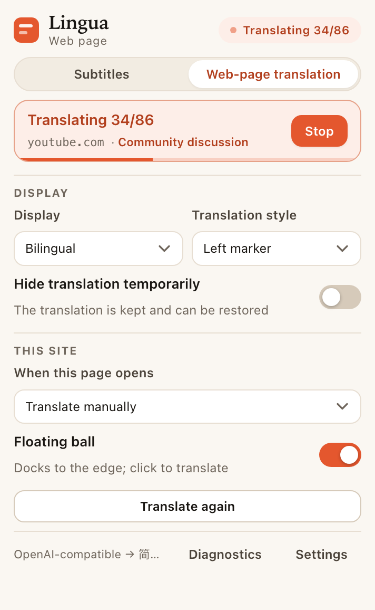
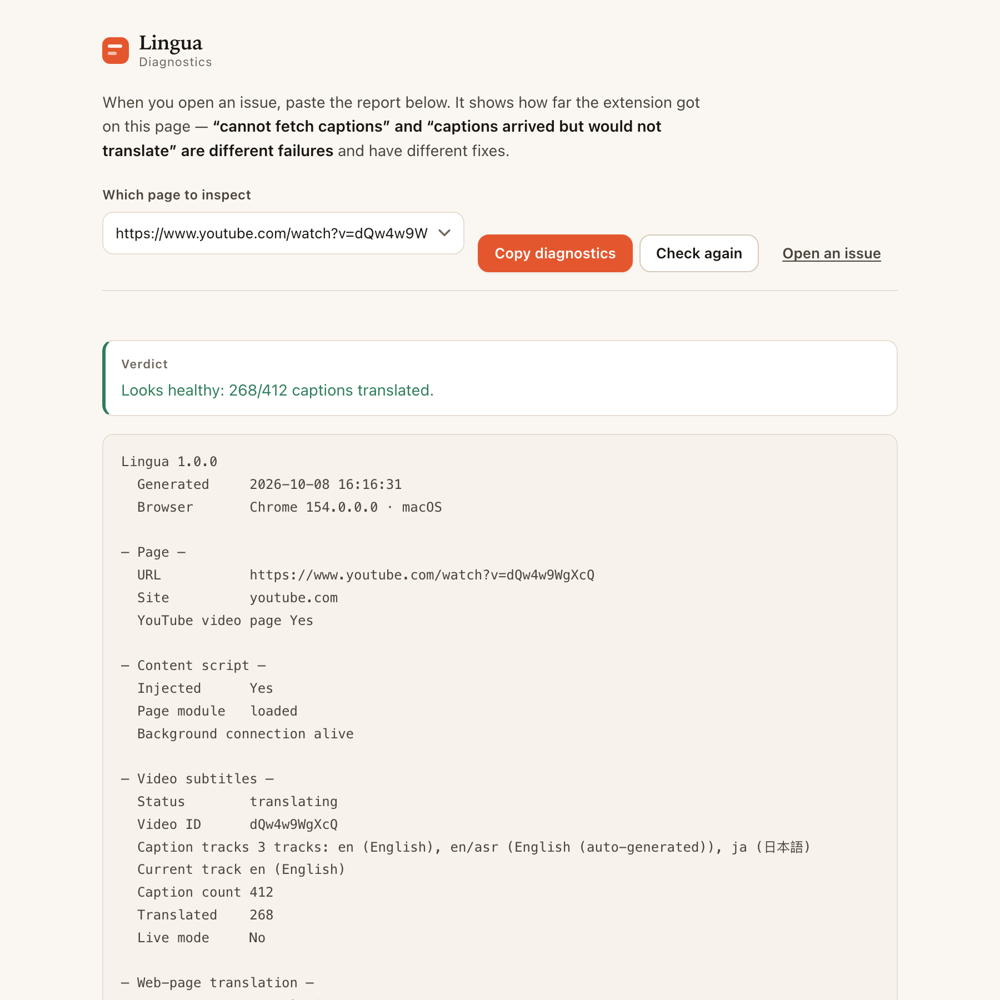

# Lingua

**English** · [简体中文](README.zh-CN.md)

[](https://github.com/Momoxiao/lingua-translate/actions/workflows/ci.yml)
[](LICENSE)
[](https://github.com/Momoxiao/lingua-translate/releases/latest)

**Website:** [lingua homepage](https://momoxiao.github.io/lingua-translate/) · **Source:** [GitHub](https://github.com/Momoxiao/lingua-translate)

<h3 align="center">Bilingual YouTube subtitles and whole-page translation, powered by your own translation API.</h3>

<p align="center">
  <a href="https://github.com/Momoxiao/lingua-translate/releases/latest/download/lingua-0.2.2.zip"><b>Download Lingua 0.2.2</b></a>
  ·
  <a href="#install">Install in 30 seconds</a>
  ·
  <a href="#configure">Configure a provider</a>
</p>

<p align="center">
  <a href="https://github.com/Momoxiao/lingua-translate"></a>
</p>

<p align="center">
  
</p>

**No account. No server of ours. Your API key never leaves your machine.** Lingua is a Manifest V3 extension for Chrome and Edge that translates **YouTube captions in sync with playback** and **web pages without destroying the original**. Bring OpenAI-compatible (OpenAI, DeepSeek, Kimi, GLM, Qwen, SiliconFlow, OpenRouter, Groq, and your own Ollama / LM Studio / one-api), DeepL, Google, Microsoft Azure, or any HTTP endpoint you can describe.

## Why people keep it installed

- **The line is already translated when it is spoken.** Lingua ingests the whole caption track up front, then translates ahead of the playhead; drag the scrubber and the priority re-sorts around the new position.
- **A translated page is still the page.** Nothing is overwritten: the original stays in the DOM and can be restored with one class flip. Links, hover states and click handlers survive because Lingua moves the real element instead of cloning it.
- **Bring your own key, keep the whole product.** Every feature is unlocked, including local Ollama / LM Studio endpoints, so sensitive text can stay on your machine.
- **It tells you where it broke.** The built-in diagnostics page reports the exact layer — content script, worker, caption track, response body, or provider request.

<table>
  <tr>
    <td width="50%"><br><sub>Web page · bilingual</sub></td>
    <td width="50%"><br><sub>Web page · translated only</sub></td>
  </tr>
  <tr>
    <td><br><sub>Popup · live controls</sub></td>
    <td><br><sub>Diagnostics · one-click report</sub></td>
  </tr>
</table>

---

## Why this exists

Translation extensions usually make one of three trades. This one refuses all three.

| | The usual trade | Here |
| --- | --- | --- |
| **Data** | Text (and often the page URL) passes through the vendor's own servers | Text goes **directly** from your browser to the service **you** configured. There is no server of ours to pass through. |
| **Money** | A free tier that is really an upsell, with your own key locked behind a subscription | **Bring your own key, every feature unlocked.** MIT licensed, no paid tier, nothing withheld. |
| **Opacity** | Minified bundle, "trust us" | **12,413 lines across 38 files, zero build step, zero dependencies.** Read the whole extension in an afternoon. |

It is also honest about the one thing it cannot promise — see [Known limitations](#known-limitations).

## What it does

- **Bilingual YouTube subtitles.** Fetches the whole caption track up front and translates it ahead of the playhead, so the line is already there when it is spoken — not two seconds after. Drag the scrubber and the priority re-sorts around the new position. Manual and auto-generated (`asr`) tracks both work; you can pin the source language manually.
- **Whole-page translation that preserves the page.** Two modes: **bilingual**, or **translated only**. Nothing is overwritten — the original stays in the DOM, hidden with CSS. "Temporarily hide the translation" is a class flip, so there is no re-render, no flash, and a failed translation can never lose the original text.
- **Links stay clickable.** A translated link is the **original element**, moved — not a clone. Cloning copies attributes but not event listeners, so a cloned link looks right and does nothing. Hover states, click handlers, and `target` all survive.
- **It adapts the register to the page.** Technical documentation, academic papers, news, forum threads, e-commerce listings, or general prose — a small set of register rules is picked per page, so API names, citation markers, code identifiers and brand names are kept intact instead of being mangled into fluent nonsense.
- **Any translation service.** OpenAI-compatible, DeepL, Google, Microsoft Azure, or a fully user-defined HTTP provider: you write the URL, method, headers, body template, and the path to pull the text out of the response.
- **A diagnostics page, because "it doesn't work" is not a bug report.** One click reads the extension's real state on the current tab — was the content script injected, is the background connection alive, how many caption tracks were found, how many cues, which layer the translation stalled at — and copies it as text you can paste into an issue.

## Install

**Download the extension**

[**Lingua 0.2.2 (zip)**](https://github.com/Momoxiao/lingua-translate/releases/latest/download/lingua-0.2.2.zip) · [checksum](https://github.com/Momoxiao/lingua-translate/releases/latest/download/lingua-0.2.2.zip.sha256) · [all releases](https://github.com/Momoxiao/lingua-translate/releases)

1. Unzip the download.
2. Open `chrome://extensions` (Edge: `edge://extensions`) and turn on **Developer mode**.
3. Click **Load unpacked** and choose the unzipped folder.
4. The settings page opens on first install. Pick a provider and paste your API key.

**From source** — clone the repository and load the repo root as an unpacked extension:

```bash
git clone https://github.com/Momoxiao/lingua-translate.git
```

To verify the download, run this from the folder containing **both** downloaded files:

```bash
shasum -a 256 -c lingua-0.2.2.zip.sha256
```

## Configure

Settings → **Translation service** → pick a provider → paste your API key. The **Test connection** button tells you whether it works before you rely on it. If you run Ollama or LM Studio locally, choose *OpenAI-compatible* and point the base URL at `http://localhost:11434/v1` (or similar) — then nothing leaves your machine at all.

## How it works

Three problems were hard enough to be worth writing down. The full set of ~30 engineering notes is in the [Chinese README](README.zh-CN.md#十设计取舍记录).

**1. YouTube signs caption requests, so a plain `fetch` returns nothing.**
Since 2025 `/api/timedtext` is signed with a Proof-of-Origin token minted by BotGuard, and the URL in `ytInitialPlayerResponse` carries no `pot`. Fetching it yields **HTTP 200 with an empty body** — a failure that looks like success. The extension reuses the token the player itself already obtained, falling back through four strategies, the last of which is "whatever track the player happened to fetch".

**2. Timing.** The scheduler is priority-ordered around the playhead, not sequential. Chunk sizes adapt, the first batch is deliberately small (four lines on screen in about a second beats sixteen lines in three), and retries skip units that already succeeded — otherwise a single render error inside a chunk re-translates the whole chunk and a double-count shows up as *"translated 391 / 381"*.

**3. Rendering without breaking the page.** Grouping by *element* rather than by text node keeps `<p>Hello <b>world</b></p>` as one translation unit with its context, at the cost of having to exclude flex/grid layout containers explicitly. And `display`'s **computed** value lies: a flex container blockifies its children, so `<nav style="display:flex"><a>Home</a></nav>` reports `display:block` for the link — trust that and every nav link's translation lands *below* the link, wrapping the navbar onto two lines.

## No build step, no dependencies

`package.json` has no `dependencies` and no `devDependencies`. There is no bundler, no transpiler, and no `node_modules`. The extension is the source you read — `manifest.json` plus `src/`, loaded as-is. That is a deliberate constraint, not a gap:

- **You can audit it.** 12,413 lines, plain ES2020, no generated code.
- **Nothing can rot.** No lockfile to drift, no transitive update to break the build in two years.
- **Packaging is reproducible.** `npm run dist` produces a byte-identical zip for the same source (fixed timestamps, sorted entries), which is what makes a published SHA-256 meaningful.

## Tests

```bash
npm run check       # 601 assertions across four suites, plus the docs, asset and i18n guards
npm test            # 190 — core logic: batching, parsing, all five providers
npm run test:live   #  58 — the realtime caption fallback, and when it must NOT engage
npm run test:dom    # 168 — paragraph detection, link handling, real doc sites
npm run test:pages  # 185 — popup, settings page, diagnostics verdicts
npm run test:e2e    #  75 — real Chrome, unpacked extension, real HTTP page
npm run check:docs  #  51 — the numbers quoted in this file are still true
npm run check:assets #  48 — store and social images have the required sizes
npm run check:i18n  #   8 — no missing references, no Chinese fallbacks in English

npm run preview     # render every UI surface to PNG
npm run demo:gif    # rebuild docs/lingua-demo.gif from real overlay frames
npm run smoke       # live captions against real YouTube (throwaway profile)
npm run inspect     # read the extension's real state out of YOUR browser
```

`npm test` needs neither a browser nor a network. The rest drive a real headless Chrome through a hand-written CDP client in `scripts/lib/` (Node's built-in WebSocket is rejected by Chrome's DevTools endpoint, so the transport is ~120 lines of `node:net`).

CI runs the four offline suites. `test:e2e` and `smoke` are deliberately not in CI: the first loads an unpacked extension into a real profile, the second hits real YouTube and its result depends on the browser profile.

## Known limitations

- **The caption path depends on YouTube's private interface and is not covered by CI.** `youtube.js` / `inject.js` / `bridge.js` lean on the player's internal response and on a Proof-of-Origin token. YouTube can change it without notice. This is the project's single largest risk and it is stated here rather than buried.

  **What has actually been measured.** Earlier revisions of this file claimed the blocking variable was *playback*, and that automation could never get a player to request a caption track. Both were wrong, and a headed run measures it directly:

  - A playing video with captions switched on makes the player issue **6–9 `/api/timedtext` requests**. The earlier "0 requests" reading came from runs where nothing had asked the player to show captions, so there was nothing to observe.
  - Requests **without** a `pot` return **HTTP 200 with a 0-byte body**. This is the real trap: a failure that looks exactly like success.
  - Requests **with** a `pot` return **~1.1–1.3 KB of real caption data**. The player mints its own token; the `baseUrl` handed to us in `ytInitialPlayerResponse` does not carry one.
  - Login state is **not** the variable. A signed-in session answers identically to a throwaway profile.

  So the whole-track path is **timing-dependent, not permanently broken**: `extractCues()` nudges the player and sniffs the token from the request the player then makes itself, and whether that lands inside the ~10 s window decides the outcome. The same command on the same video produced both `60/60 cues translated` (token sniffed in time) and a fall-through (token arrived too late) across consecutive runs.

  **Which is why the realtime fallback exists.** When the token does not arrive in time, the player is often *still rendering the lines it is speaking* into `.ytp-caption-segment`, even though its own caption requests came back empty. `live.js` reads those and translates them one at a time, trading the pre-fetch ahead of the playhead for a beat of latency, one line at a time, and saying so on screen instead of going blank.

  **"Often", not "always" — and that distinction is measured, not hedged.** Across one evening of headed runs on the same video: three runs took the fast path (`pot=有`, ~1.2 KB responses, 60/60 cues); one run fell back and *did* read real lines (`实时兜底 读到 2 行 · 译出 1 行`) even though none of the requests in that run carried a `pot`; and one run failed completely — 8 caption requests, none with a `pot`, all 8 response bodies read as **0 bytes** (captured bodies, not a byte-count inference), the player created no caption container, and the fallback read 0 lines. So the fallback rescues the common case, not every case, and the earlier wording promised captions on both paths, and that was one measurement too confident. `npm run smoke` prints the DOM reading beside the line counters — container present or not, how many `.ytp-caption-segment` nodes, and their text — so a zero-line fallback now says which of the two it was instead of telling you to run it again.
- On some videos the whole-track path may still fall back to realtime even when the token is available; the realtime path is slower and translates line by line rather than ahead of the playhead.
- The extension UI ships in Chinese and English. Chinese is the source language and the fallback; every non-Chinese browser gets the English catalogue.
- Subtitles work on `youtube.com` / `youtube-nocookie.com` watch pages only.
- Web-page translation runs in the top document — iframes and text inside images are not translated.
- Live streams use the same realtime path by necessity — there is no whole track to pre-fetch.
- Verified on Chrome on macOS. Edge is untested; **Firefox would need separate MV3 work.**
- The `<all_urls>` host permission is what makes whole-page translation and the user-defined provider possible. If you only want YouTube subtitles, delete the third `content_scripts` entry and `<all_urls>` from `manifest.json`.

## Privacy

**No server, no account, no analytics, no data collection.** The only thing that leaves your machine is the text being translated, sent straight to the translation service you configured. Credentials, cache and settings live in `chrome.storage.local`. Full detail — including what the diagnostics report does and does not contain: [`PRIVACY.md`](PRIVACY.md).

## Contributing

**The most useful thing you could contribute right now:** a screenshot or a 10-second GIF of the subtitle overlay captured from a **real** YouTube page on **Windows or Linux** — this has only ever been verified on macOS. The harness renders the overlay from the real `overlay.js`, so the README image cannot drift from the code, but every screenshot here was produced on one machine, and a real capture from another platform is worth more than another mock.

Issues and PRs welcome. Before reporting a caption problem, please run the **diagnostics page** (extension icon → **Diagnostics** → **Copy report**) and paste the output: "no captions found" and "captions found but the fetch came back empty" are entirely different failures with entirely different fixes, and that report is the only thing that tells them apart. It contains no API key and no translated text.

## License

[MIT](LICENSE). Use it, modify it, ship it commercially — just keep the copyright notice.
