# Lingua — 浏览器翻译扩展（视频字幕 + 网页翻译）

[English](README.md) · **简体中文**

[](https://github.com/Momoxiao/lingua-translate/actions/workflows/ci.yml)

**官网：** [Lingua 项目主页](https://momoxiao.github.io/lingua-translate/) · **源码：** [GitHub](https://github.com/Momoxiao/lingua-translate)

> **早期版本（0.2.6）。** 功能完整，有 600 多项自动化断言，但尚未经过真实用户的广泛使用——欢迎反馈问题。
>
> **视频字幕依赖 YouTube 的私有接口**（播放器内的 PoToken、字幕轨请求），不是公开 API。**YouTube 一更新就可能失效**，而且这条链路无法在 CI 里覆盖（见第九节），只能靠人工实测。遇到失效请开 Issue。

高性能的 Chrome / Edge 扩展（Manifest V3）：

- **YouTube 双语字幕**：整片预取字幕，边播边翻，双语叠加在播放器上
- **网页翻译**：任意网站网页翻译，原文不被破坏，可随时还原
- 两者共用同一套翻译引擎与缓存

**核心特点**

- **可接入任意云端 API**：OpenAI 兼容接口、DeepL、Google、微软 Azure，以及一个完整的「自定义供应商」——任何 HTTP 翻译接口都能接。
- **整片预取 + 优先级调度**：进入视频即取回整条字幕轨，先翻播放位置附近，再向前推进；拖动进度条会自动重排优先级。
- **网页翻译按视口优先**：先翻屏幕内的段落，滚动时自动重新排优先级，动态加载的内容也会持续跟进。
- **快**：批量合并翻译（40 句 ≈ 3 个请求）、并发池、命中缓存则零请求、自适应降级修复漏译。
- **零构建**：不用打包器，直接「加载已解压的扩展程序」即可运行。

扩展面板按页面上下文显示面板：普通页面只有「网页翻译」；YouTube 视频页两半都成立，所以出现切换器。

| YouTube · 字幕与播放同步翻译 |
| --- |
| 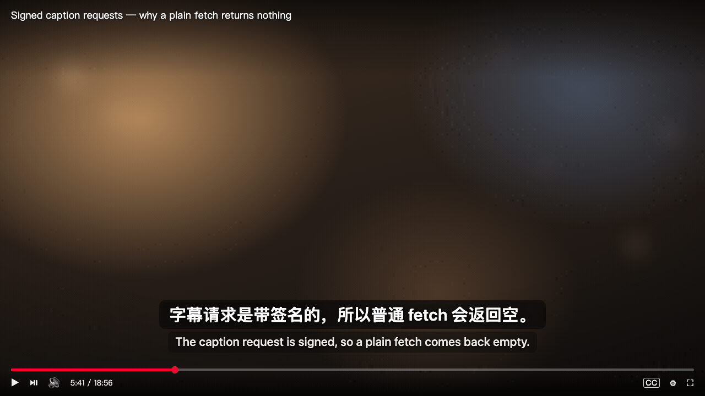 |

| 弹窗 · 视频字幕（YouTube） | 弹窗 · 网页翻译（YouTube，切过去） | 弹窗 · 网页翻译（普通页面） | 设置页 |
| --- | --- | --- | --- |
| 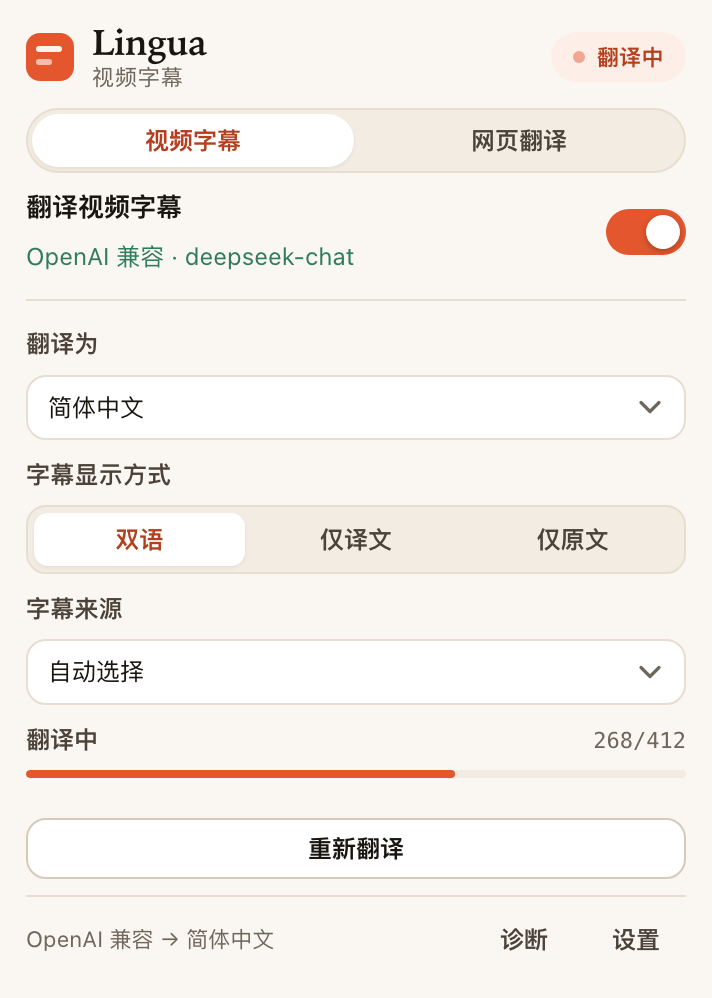 | 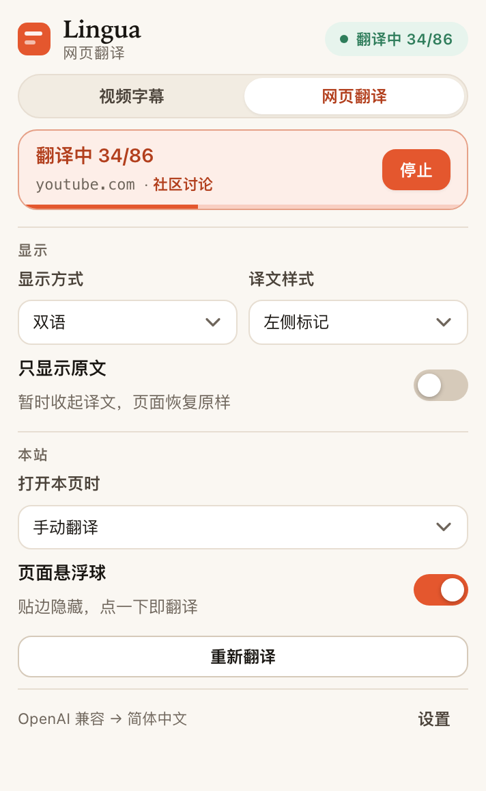 |  | 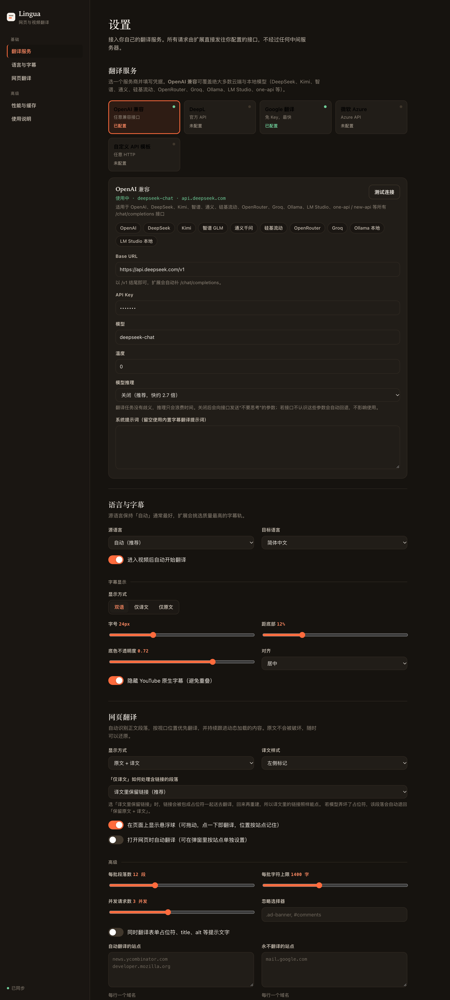 |

| 自定义供应商（含校验与请求预览） | 页面悬浮球（悬停展开） | 网页翻译 · 双语 | 网页翻译 · 仅译文 |
| --- | --- | --- | --- |
| 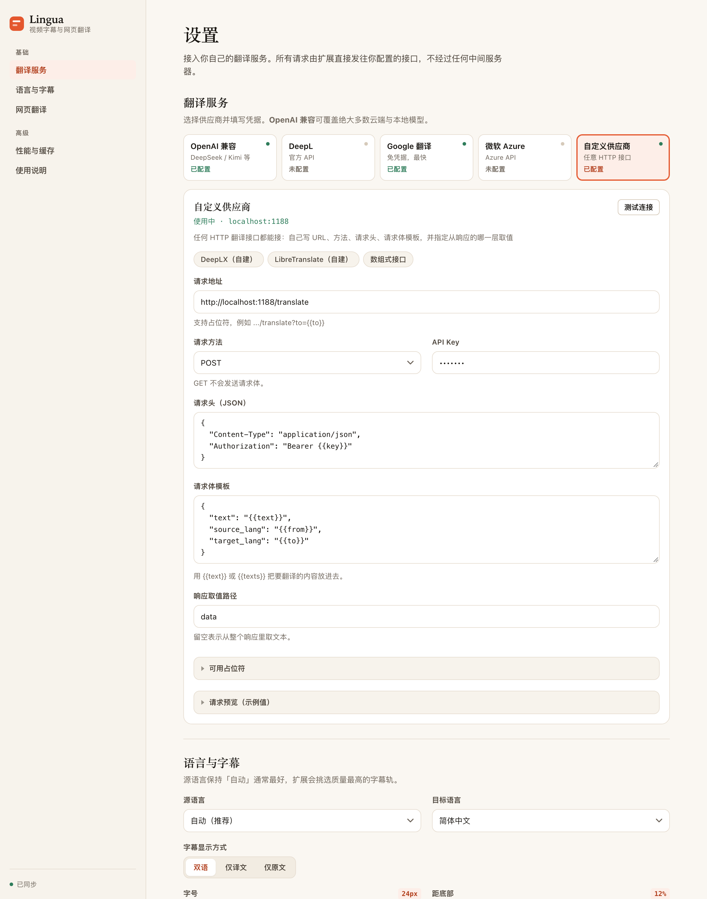 | 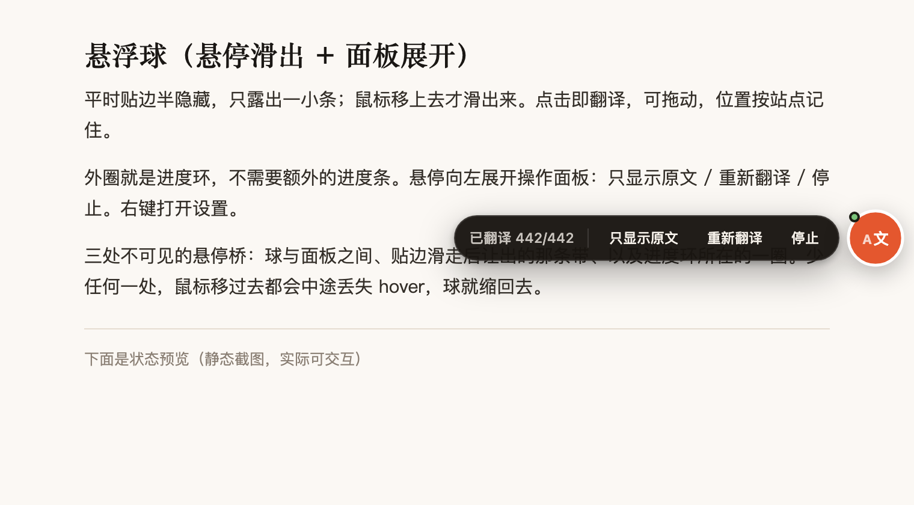 | 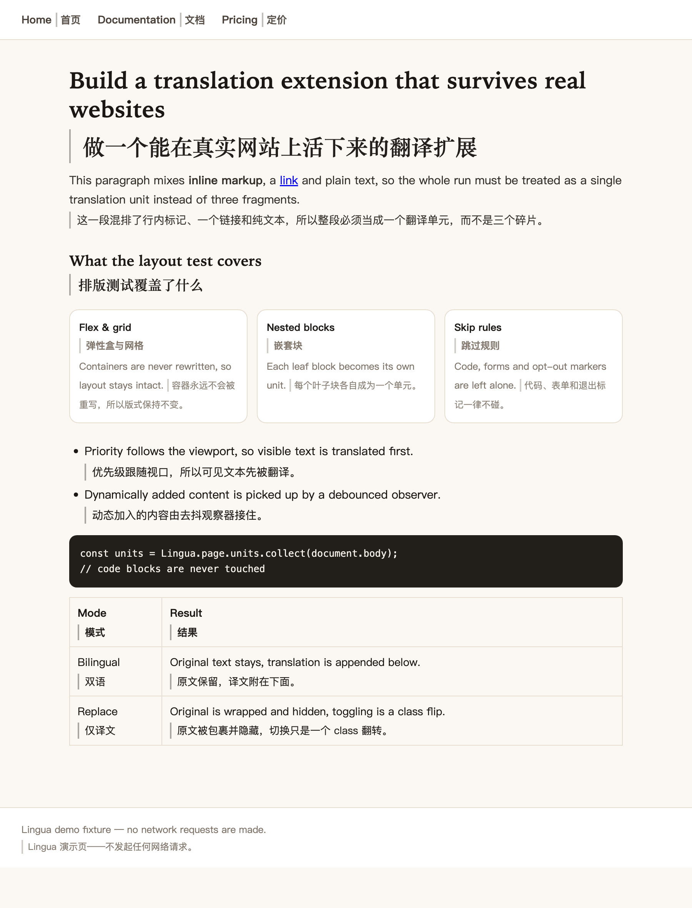 | 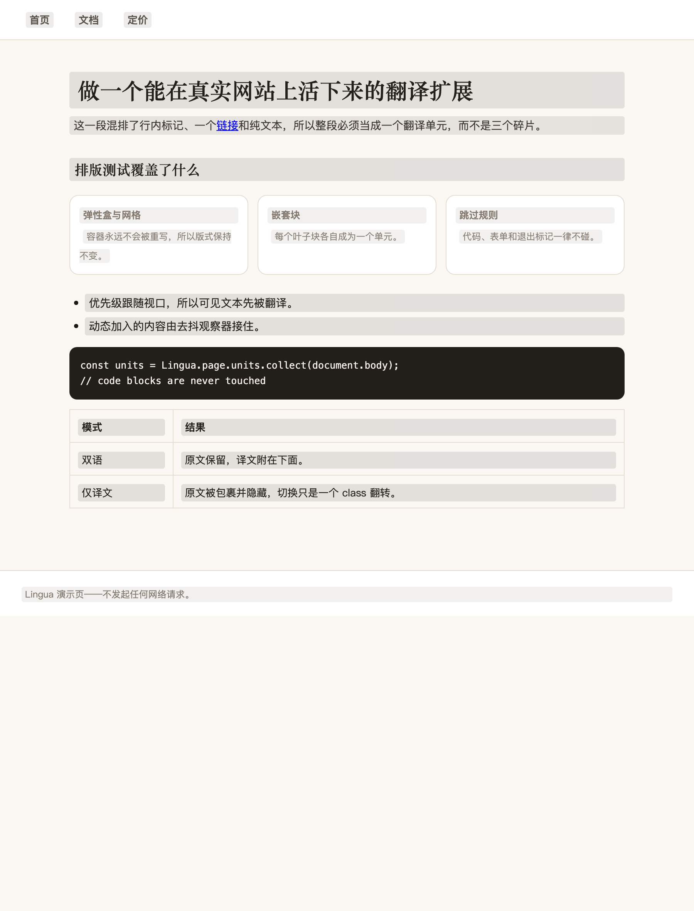 |

跟随系统的深色模式（设置页与弹窗都支持）：

| 设置页 · 深色 | 弹窗 · 深色 |
| --- | --- |
| 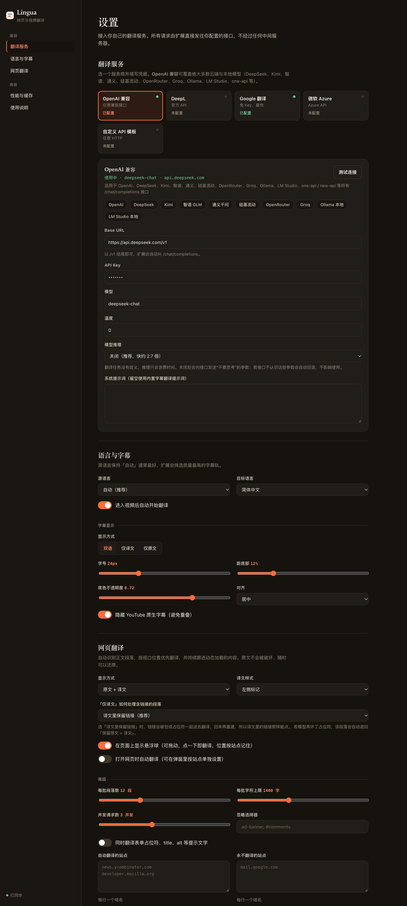 | 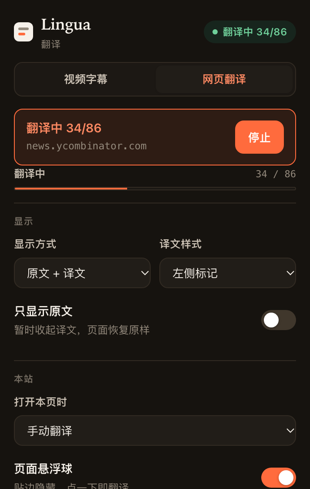 |

---

## 一、为什么不能直接请求字幕接口

2025 年起，YouTube 给字幕接口 `/api/timedtext` 加上了 **PoToken**（BotGuard 生成、与视频 ID 绑定的证明令牌）。任何脱离页面的直接请求都会拿到 **HTTP 200 + 空 body**——不报错，只是空。

浏览器扩展有一个天然优势：**它就跑在已经解出这道题的页面里**。所以本扩展不去自己伪造 token，而是**复用播放器自己铸造的 `pot`**：

1. 从 `ytInitialPlayerResponse` 拿到轨道列表，**用 `audioTracks[].defaultCaptionTrackIndex` 定位视频的原始语言轨**（见下方「为什么必须选原始语言轨」）
2. 先用页面上下文直接请求该轨的 `baseUrl`（部分视频仍然可用）
3. 失败则**复用已经截获到的播放器的 `pot`**，把它合并进目标轨的 URL 再请求
4. 还没有 `pot` 就**主动触发一次播放器的字幕请求**（用播放器 API 切到目标轨 + 循环一次 CC 开关，原生字幕被我们的 CSS 隐藏所以用户看不到闪烁），截获它的 `pot` 后重试
5. 再兜底 `/youtubei/v1/get_transcript`
6. 直播场景读取页面已渲染的字幕行做实时翻译

对应代码：`src/content/inject.js`（MAIN world 拦截）与 `src/content/youtube.js` 的 `extractCues()`。

**为什么必须选原始语言轨**：实测某个视频有 22 条轨，其中唯一的「非自动生成」轨 `zh-Hant` 只包含**前 34 秒**的翻译内容，而 `defaultCaptionTrackIndex` 指向的 `en/asr` 覆盖了**全部 336 秒**。按「优先人工字幕」的直觉去选，反而会挑到残缺的轨。

**贴片广告**：广告播放期间 `movie_player.getPlayerResponse()` 返回的是**广告自己的**播放器响应，轨道和时长都属于广告。所以检测到 `#movie_player.ad-showing` 时会先等广告放完再加载字幕。

---

## 二、安装

**方式一：下载安装包（推荐）**

从 [Releases](https://github.com/Momoxiao/lingua-translate/releases/latest) 下载 `lingua-<版本>.zip` 并解压，然后：

1. 打开 `chrome://extensions`（Edge 为 `edge://extensions`）
2. 右上角开启 **开发者模式**
3. 点击 **加载已解压的扩展程序**，选择解压出来的目录
4. 首次安装会自动打开设置页；填入翻译服务后即可使用

安装包里只有运行需要的文件（`manifest.json` + `src/` + `icons/` + `LICENSE`，44 个文件、约 159 KB）。想核对下载是否完整，可以和 Release 里的 `.sha256` 比对：

下载后，把 `lingua-0.2.6.zip` 和 `lingua-0.2.6.zip.sha256` 放在同一目录，从该目录执行：

```bash
shasum -a 256 -c lingua-0.2.6.zip.sha256
```

**方式二：直接用源码**

克隆仓库后按同样步骤选择仓库根目录即可。源码里多了测试、文档配图和 CI 配置，扩展运行时用不到。

**自己打包**

```bash
npm run dist     # 生成 dist/lingua-<版本>.zip，并写出配套的 .sha256
```

打包脚本会校验 `manifest.json` 引用的每个文件都在包里，缺一个就报错退出——避免发出一个「装得上、跑起来才报错」的包。输出是确定性的（固定时间戳、条目排序），所以同样的源码每次打出的字节完全一致，Release 里公布的 SHA-256 才有意义。`.sha256` 由脚本直接写在 zip 旁边，不用再从终端里抄一遍：**公布的校验值必须和公布的字节是同一批**，而「手工抄一次」正是这两者悄悄对不上的地方——尤其是改完源码重打包、却忘了换掉旧哈希的时候。

> 需要 Chrome 111+（用到了 content script 的 `world: "MAIN"`）。

---

## 三、配置翻译服务

### 3.1 OpenAI 兼容（推荐，覆盖面最广）

设置页 →「翻译服务」→ 选 **OpenAI 兼容**，点击预设按钮一键填充，再填 API Key。

内置预设：

| 服务 | Base URL | 默认模型 |
| --- | --- | --- |
| OpenAI | `https://api.openai.com/v1` | `gpt-4o-mini` |
| DeepSeek | `https://api.deepseek.com/v1` | `deepseek-chat` |
| Kimi | `https://api.moonshot.cn/v1` | `moonshot-v1-8k` |
| 智谱 GLM | `https://open.bigmodel.cn/api/paas/v4` | `glm-4-flash` |
| 通义千问 | `https://dashscope.aliyuncs.com/compatible-mode/v1` | `qwen-plus` |
| 硅基流动 | `https://api.siliconflow.cn/v1` | `Qwen/Qwen2.5-7B-Instruct` |
| OpenRouter | `https://openrouter.ai/api/v1` | `google/gemini-2.0-flash-exp:free` |
| Groq | `https://api.groq.com/openai/v1` | `llama-3.3-70b-versatile` |
| Ollama（本地） | `http://localhost:11434/v1` | `qwen2.5:7b` |
| LM Studio（本地） | `http://localhost:1234/v1` | `local-model` |

任何实现 `/chat/completions` 的网关（one-api / new-api / vLLM / LiteLLM…）都可以直接填 Base URL 使用。

### 3.2 DeepL / Google / 微软

- **DeepL**：填 API Key 即可（Free 与 Pro 的接口地址不同，设置里可改）。
- **Google**：留空 Key 走免费网页接口；填 Google Cloud Translation v2 的 Key 则走官方接口。
- **微软 Azure**：填 Subscription Key 与区域。

### 3.3 自定义供应商

选择「自定义供应商」，用占位符拼装任意接口。设置页里内置了三套模板（DeepLX、LibreTranslate、数组式接口）可直接套用，下面这张表在界面上也能展开查看：

| 占位符 | 含义 |
| --- | --- |
| `{{text}}` | 整批文本（已编号的多行字符串） |
| `{{texts}}` | 原始句子数组（JSON 字面量）——出现它即切换为「数组模式」 |
| `{{from}}` / `{{to}}` | 语言代码 |
| `{{source}}` / `{{target}}` | 语言名称 |
| `{{key}}` | API Key |

占位符可用于 **请求地址、请求头、请求体** 三处。

**界面会替你把关**（这些都是真实会踩的坑，不是装饰）：

- 请求头不是合法 JSON → 直接报错，因为后台会拒绝发起请求
- 方法选了 `GET` 却写了请求体 → 报错，GET 不会发送 body
- 请求体里没有 `{{text}}` / `{{texts}}` → 提示，接口收不到要翻译的内容
- 请求地址和请求体里都没有 `{{to}}` / `{{target}}` → 提示，译文语种可能不对
- 展开「请求预览」可以看到按示例值拼装出来的完整请求

**示例 A — 返回编号文本的自建接口**

```
POST https://api.example.com/translate
Body: { "text": "{{text}}", "source": "{{from}}", "target": "{{to}}" }
响应取值路径: (留空)
```

只要接口按 `1. …\n2. …` 的编号格式返回，就会自动对齐到原句。

**示例 B — 返回数组的接口**

```
POST https://api.example.com/v1/translate
Body: { "q": {{texts}}, "target": "{{to}}" }
响应取值路径: data.translations
```

数组长度与输入句数一致时按索引对齐。

**示例 C — 带 Bearer 鉴权**

```
Headers: { "Authorization": "Bearer {{key}}", "Content-Type": "application/json" }
```

---

## 四、网页翻译

点击扩展图标 → 切到「网页翻译」标签 → 打开「翻译此页面」。也可在设置里开启自动翻译，或用弹窗的「本站规则」按域名单独设置。

### 页面悬浮球

页面上常驻一个可拖动的悬浮球，**点一下就开始翻译**，不用再去点工具栏图标：

| 操作 | 行为 |
| --- | --- |
| 单击 | 开始 / 停止翻译 |
| 悬停 | 从贴边处滑出，并展开操作面板：暂时收起译文 · 重新翻译 · 停止 |
| 拖动 | 移动位置，**按站点记住**；松手吸附到最近的左右边缘 |
| 右键 | 直接打开设置 |

**贴边隐藏**：吸附到边缘后，球只露出一小条（12px），鼠标移上去才滑出来——平时几乎不占视野。球与操作面板之间有一条**不可见的悬停桥**，所以鼠标从球移向面板时不会中途失去 hover 而让面板收起。

球的外圈就是进度环——翻译时显示进度，不需要额外的进度条。状态用颜色区分：灰=未翻译，橙=翻译中/已翻译，红=出错，完成后右上角有一个小绿点。

整个球活在 **Shadow DOM** 里，站点的样式进不来，球的样式也漏不出去。设置页和弹窗里都可以关掉它。

### 「暂时收起译文」是什么意思

点它会**把译文整体隐藏**，页面恢复成翻译前的样子；按钮随之变成「恢复译文」，点一下切回。译文本身一直留着，所以来回切是瞬时的。

它**不是**「双语」开关——双语请用显示方式里的「双语」。

也不要和视频字幕面板的**「仅原文」**混起来：那是字幕的一个**持久档位**（选定后一直只显示原文），而这个是网页译文的**临时开关**。两者名字接近，但一个改的是「字幕怎么显示」，一个改的是「译文现在收不收起来」。

含链接的段落有个细节：译文里的链接是从原文**搬运**过去的真实元素，所以在切换时会随之交接——哪一份可见，链接就在哪一份里。

### 自适应翻译风格

一个译者不会用同一种语体翻所有东西：Rust 参考手册、新闻稿和 Reddit 楼层需要不同的术语规则，也需要对「什么不该翻」做不同的判断。所以扩展会**从页面本身推断该用哪套规则**，不需要你按站点配置。

内置六套：**技术文档 / 学术论文 / 新闻资讯 / 社区讨论 / 电商购物 / 通用**。判定只看结构性证据，不看正文内容：

| 证据 | 指向 |
| --- | --- |
| `<pre>` 密度、行内 `<code>` 数量、URL 里的 `/docs/` `/guide/` `/reference/`、`docs.` `developer.` 子域、JSON-LD 的 `TechArticle` | 技术文档 |
| `math` / KaTeX / MathJax 节点、引用标注、arxiv / doi / pubmed 域名、`ScholarlyArticle` | 学术论文 |
| `NewsArticle` / `BlogPosting`、`og:type=article`、多个 `<time datetime>` | 新闻资讯 |
| 评论节点数量、`QAPage` / `DiscussionForumPosting`、Hacker News / Reddit / Stack Overflow 等域名 | 社区讨论 |
| `Product` / `Offer`、价格节点、`og:type=product`、电商域名 | 电商购物 |

每套档位带一组语体规则，例如技术档会要求「API 名、函数名、CLI 参数、文件路径、包名、CSS 选择器原样保留」，并且明确「中文开发者习惯直接用英文的词（props / hook / commit）不要硬译」。这些规则写在 `constants.js` 里，**页面只能送来一个 id，送不了提示词文本**。

两条工程上的取舍：

- **误判的代价不对称**。判成技术档最多是多一条术语规则，对普通文章无害；漏判则恰好丢掉了最需要术语约束的场景。所以技术档的权重给得偏积极——一个 `/docs/` 路径或一个 `docs.` 子域就足以判定。阈值在 `profile.js` 里，可以调。
- **识别只做一次**。页面不会翻到一半换体裁，而每批都重扫一遍 DOM 是纯浪费，所以档位在 `start()` 时定下，整轮沿用。

设置页可以手动指定档位，也可以写「附加要求」（会追加到提示词末尾）。扩展面板会显示实际判定结果（如「社区讨论 · 自动识别」），所以这个行为是可观察、可反驳的，不是黑盒。**只对 OpenAI 兼容生效**——DeepL / Google / 微软走的是纯翻译接口，没有提示词这一层。

### 它是怎么决定翻译哪些内容的

这是网页翻译最容易做坏的地方。规则是：

> 一个元素是「翻译单元」 ⟺ 它的子树里没有任何块级元素，且它不是布局关键容器（flex / grid / display:contents）

由此自然得到几个正确行为：

| 页面结构 | 结果 |
| --- | --- |
| `<p>Hello <b>bold</b> world</p>` | 合成**一个**单元（`Hello bold world`），不会碎成三段 |
| `<div class="flex"><span>Label</span><span>Value</span></div>` | flex 容器被排除，两个 span 各自成为单元 —— **flex 布局完全不受影响** |
| `<button>Platform<svg/></button>`（`display:flex`） | **容器自己的文本也会被翻译**：只把那段文本节点包进一个行内 span，位置正好顶替原来的匿名 flex item，布局不变 |
| `<nav><a>Home</a><a>About</a></nav>` | nav 只作容器，两个链接各自成单元（否则会被合并成一句） |
| `<div><p>a</p><p>b</p></div>` | 外层 div 只作容器，两个 p 各自成单元 |
| `<pre>` `<code>` `<textarea>` `<script>` | 直接跳过 |
| `translate="no"` / `.notranslate` / `contenteditable` | 整棵子树跳过 |
| 纯数字、纯符号、单字符 | 不发请求 |
| 视频播放器区域 | 内置忽略（`.html5-video-player` 等） |

### 两个反直觉的坑

**① flex/grid 会把子元素「块级化」。** 一个 `<span>` 一旦成为 flex item，它的 computed `display` 就变成 `block`。如果拿 computed display 去判断「这个子元素是不是块级边界」，就会把普通的 flex 容器误判成容器，导致**容器自己的文本被整段跳过** —— GitHub 导航栏的 `Platform` 按钮就是这么漏掉的。修法是：父元素是 flex/grid 时，不用 computed display 判断子元素是否分隔内容。

**② 「仅译文」模式会连超链接一起藏掉。** 把原文整体隐藏，里面的 `<a>` 自然也看不见了。

解法是**占位符对齐**：把链接包成 `⟦1⟧链接文字⟦/1⟧` 一起送去翻译，提示词要求模型原样保留标记，译文回来后按标记重建，于是**译文里也有可点的链接**：

```
输入  Read the ⟦1⟧documentation⟦/1⟧ for details.
译文  详情请阅读⟦1⟧文档⟦/1⟧。
渲染  <p><span class="lingua-pg-dst">详情请阅读<a href="…">文档</a>。</span></p>
```

实测 Wikipedia：**453 段里 427 段真正替换了原文**（此前只有 75 段），**519 个链接全部可见可点**，链接文字也跟着翻译了（`Donate` → `捐赠`）。

**模型偶尔会写坏标记**（实测 519 个链接里出现 1 次：`⟦1⟧X⟦/1⟧` 被写成 `X⟧/1⟧`）。这时**该段落自动退回双语显示**，链接照常可用，并且会清洗掉残缺标记——绝不会在页面上留下 `⟦` 之类的乱码。

设置页可以三选一：「译文里保留链接」（默认）/「退回双语（链接保持可点）」/「严格替换（链接会丢失）」。

### 搬元素，不克隆元素

重建译文时**必须搬运真实的元素，不能用 `cloneNode()`**。克隆体只复制属性、**不复制事件监听器**，会静默废掉挂在元素上的一切：悬浮预览、SPA 路由、埋点统计。

搬运时记录原始父节点与位置，还原时精确放回；同时**文字没变化就一个字节都不动**——引用标注 `[1]`、数字、代码这类内容本来就不需要翻译，保持原样意味着它的内部结构和事件完全不受影响。

### 搬运的必须是「原子行内单元」，而不是 `<a>` 本身

Wikipedia 的引用标注长这样：

```html
<sup class="reference"><a href="#cite_note-1">[1]</a></sup>
```

如果只把 `<a>` 搬进译文，它的父级 `<sup>` 会留在原地（隐藏的原文里）——整个引用标注连同挂在 `<sup>` 上的悬浮预览就一起消失了。实测修复前 **50 个引用标注有 44 个留在隐藏原文里、0 个在译文中**。

所以标记时要向上找到「只为包裹这个链接而存在」的最外层行内元素：父元素是行内元素、且只有这一个有意义子节点时继续上溯。修复后 **44/50 进入译文，0 个残留**。

### 渲染方式

**原文永远不会被破坏。**

- **原文 + 译文**：把译文追加为 `<span class="lingua-pg-dst">`，原文原封不动
- **仅译文**：把原有子节点整体搬进 `<span class="lingua-pg-src">` 再用 CSS 隐藏 —— 所以「暂时收起译文」只是切换一个 class，没有 DOM 重建，也不会有闪烁

译文配色用 `currentColor` 派生，因此在浅色站、深色站、自定义主题站上都能保证可读性，无需知道对方的调色板。

### 性能

- 按视口中心距离排序，先翻看得见的；滚动时重新排序
- 按**字符预算**分批（默认每批 12 段 / 1400 字），避免长段落把一批撑爆
- `MutationObserver` + 700ms 防抖跟进动态内容（SPA、无限滚动）
- 与字幕共用同一份缓存，重复句子零请求

---

## 五、性能设计

| 手段 | 位置 | 效果 |
| --- | --- | --- |
| 整片预取字幕轨 | `youtube.js` `extractCues()` | 一次拿到全部 cue，与播放进度解耦 |
| 批量合并翻译 | `subtitles.js` `buildBatchText` | 每批 16 句合并为一个请求，请求数降为 1/N |
| 并发池 | `translator.js` `pool()` | 可配置并发（默认 4），实测 40 句 3 个请求 |
| 优先级调度 | `youtube.js` `nextChunk()` | 按「距播放位置的加权距离」排序，先翻看得见的 |
| 自适应降级修复 | `translator.js` `translateChunk()` | 模型漏译某行 → 自动折半重试；4xx 致命错误不重试 |
| 两级缓存 | `background/cache.js` | 内存 LRU + `storage.local` 持久化，命中即 0 请求 |
| 渲染只在换行时写 DOM | `overlay.js` `tick()` | rAF + 二分查找，每帧最多几次整数比较，无布局抖动 |
| 直播实时模式 | `live.js` | 100ms 轮询 + 60ms 稳定判定 + 流式增量译文 + 最新字幕优先 + 本地去重缓存 |
| 整页按视口排序 | `page/index.js` `nextChunk()` | 先翻屏幕内的段落，滚动时重新排序 |
| 整页按字符预算分批 | `page/index.js` | 长段落不会把一批撑爆（默认 24 段 / 2400 字） |
| 动态内容跟进 | `page/index.js` `onMutations()` | MutationObserver + 700ms 防抖，跳过已翻译块 |

### 首屏延迟做了哪些优化

| 优化 | 效果 |
| --- | --- |
| 字幕获取的「直取」与「让播放器去取」**并行** | 冷启动时直取必然返回空，串行等于白等一个来回；并行省下约 1 秒 |
| **首个翻译批次只有 4 句** | 用户盯着空 overlay 时，1 秒出 4 句好过 3 秒出 16 句；后续批次恢复正常大小 |
| 网页翻译在 **DOMContentLoaded** 就开始 | 不再等 `load`（重页面可能晚好几秒）；后到的内容交给 MutationObserver |
| 整页批量提到 24 段 / 2400 字、3 路并发 | 每次调用在后台再拆成多个子批并发发出 |
| **默认关闭模型推理** | 见下节，实测约 2 倍加速 |

实测：Wikipedia 447 段从约 60 秒 → 2.0 秒 → **1.0 秒**。

### 默认关闭模型推理

翻译任务没有歧义，推理模型的「思考」纯属浪费。实测同一批 16 句：

| | 延迟 | 推理 tokens | 译文行数 |
| --- | --- | --- | --- |
| 不传参数 | 2460ms | 1188 | 48/48 |
| **发送关闭推理的参数** | **1228ms** | **0** | 48/48 |

所以扩展默认会发送「不要思考」的参数。但**各家供应商的参数名不一样**（OpenAI 用 `reasoning_effort`、Anthropic / 智谱 / Kimi 用 `thinking`、通义用 `enable_thinking`），而**发送不认识的字段可能直接返回 HTTP 400**。

因此这里做了**自动回退**：默认发送最通用的两个参数，一旦接口以 400/422 拒绝，就自动去掉参数重试一次，并在本次会话内不再发送。这样既能拿到加速，又不会因为参数不被识别而把翻译打挂。

设置页 → 翻译服务 → 模型推理，可以切回「跟随模型默认」。若模型只输出推理内容而没有译文，也会给出明确提示。

---

## 六、目录结构

```
yt-subtitle-translator/
├── manifest.json                  MV3 清单
├── README.md                      英文 README（GitHub 首页）
├── README.zh-CN.md                本文件
├── PRIVACY.md                     隐私政策（两个商店上架都要这个 URL）
├── LICENSE                        MIT
├── icons/                         16/32/48/128 图标
├── docs/                          界面截图 + launch-playbook.md（上架与冷启动手册）
├── store/SUBMISSION.md            上架提交材料：单句用途、权限理由、数据用途声明
├── scripts/
│   ├── make-icons.py              纯 stdlib 图标生成（4x 超采样）
│   ├── test-core.mjs              核心逻辑测试（198 项，无需浏览器）
│   ├── test-dom.mjs               段落识别 / 标签矩阵 / 标题（168 项，真实浏览器）
│   ├── check-pages.mjs            弹窗、设置页与诊断页的启动 + 交互检查（72 项）
│   ├── e2e-extension.mjs          真机端到端（75 项，自建 CDP 客户端）
│   ├── smoke-youtube.mjs          对真实 YouTube 的字幕链路冒烟（一次性 profile）
│   ├── inspect-live.mjs           读真实页面里扩展的状态；--refresh 做只读体检
│   ├── package.mjs                打可分发的 zip + .sha256（输出确定性）
│   ├── lib/                       chrome 定位 / CDP 客户端 / 字幕请求归因
│   └── preview.mjs                无头 Chrome 渲染检查 + 截图
└── src/
    ├── shared/                    后台与内容脚本共用（零构建关键）
    │   ├── constants.js           供应商/语言/默认设置/消息类型
    │   ├── utils.js               hash、retry、pool、getPath、「无字幕」措辞
    │   ├── settings.js            chrome.storage 读写 + 变更订阅
    │   └── subtitles.js           json3/srv3/xml 解析、去重、批量拼装/还原
    ├── background/
    │   ├── sw.js                  Service Worker 入口（importScripts）
    │   ├── translator.js          缓存 → 分块 → 并发 → 重试 → 降级修复
    │   ├── cache.js               两级缓存
    │   └── providers/             openai / deepl / google / microsoft / custom
    ├── content/
    │   ├── inject.js              【MAIN world】拦截 timedtext / player 响应
    │   ├── bridge.js              MAIN ↔ 隔离世界 ↔ 后台 的桥 + 上下文失效检测
    │   ├── youtube.js             轨道发现、cue 提取、字幕优先级调度
    │   ├── overlay.js             字幕叠加层（rAF + 二分查找）
    │   ├── live.js                直播/无轨道时的实时兜底
    │   ├── store.js               字幕与状态存储（含状态原因 reason）
    │   ├── page/
    │   │   ├── units.js           段落识别规则（翻译什么 / 绝不碰什么）
    │   │   ├── profile.js         自适应翻译风格：从页面推断该用哪套语体规则
    │   │   ├── render.js          双语叠加、链接重建与还原
    │   │   ├── ball.js            页面悬浮球（Shadow DOM，可拖动，带进度环）
    │   │   └── index.js           整页调度：视口优先级 + 字符预算分批
    │   └── main.js                内容脚本入口
    ├── diagnostics/               诊断页：读真实状态 + 一句结论
    ├── popup/                     工具栏弹窗（视频字幕 / 网页翻译 双标签）
    ├── options/                   完整设置页
    └── ui/theme.css               共享设计系统
```

### 关于「零构建」

MV3 的 Service Worker 支持 `importScripts`，内容脚本则只能加载普通脚本。因此 `src/shared/*.js` 统一写成**注册到 `globalThis.Lingua` 的经典脚本**：Service Worker 用 `importScripts` 加载，内容脚本通过 `manifest.json` 的 `js` 数组加载，两边复用同一份源码，不需要任何打包步骤。

---

## 七、开发

```bash
npm run check       # 一条命令跑完下面四套不需要真机扩展的测试，共 632 项，末尾再核对文档数字、商店素材与 i18n 目录（CI 跑的就是这个）
npm test            # 核心逻辑测试（198 项，无需浏览器、无依赖）
npm run test:live   # 实时字幕兜底：流式译文、最新字幕优先、整轨自动恢复与接管边界（81 项）
npm run test:dom    # 段落识别 + 标签矩阵 + 真实文档站标题（168 项，真实 Chrome）
npm run test:pages  # 弹窗面板切换 + 高度预算 + 设置页交互 + 自定义供应商校验 + 诊断页判断（185 项）
npm run test:e2e    # 真机端到端：起本地假接口 + 加载扩展 + 真实 HTTP 页面（75 项）
npm run check:docs  # 上面这些数字本身还成立吗——直接量 src/，并让中英 README 与 ci.yml 互相对账（53 项）
npm run check:assets # 商店素材、主页与发布版本元数据是否符合要求（60 项）
npm run check:i18n  # 英文引用是否有缺失、英文目录是否混入中文（8 项，未引用条目单独告警）
npm run inspect     # 连接你正在用的 Chrome，读某个页面里扩展的真实状态
npm run inspect:refresh  # 同上，并从零重载一次字幕，数每条 timedtext 请求（只读）
npm run smoke       # 对着真实 YouTube 跑一次字幕链路（需要联网，不进 CI）
npm run smoke:headed     # 同上，真实窗口 + GPU 开着（分辨环境问题还是代码问题）
npm run icons       # 重新生成图标
npm run dist        # 打出可分发的 dist/lingua-<版本>.zip（发布时作为 Release 附件）
npm run preview     # 无头 Chrome 渲染弹窗、设置页与网页翻译效果并截图
npm run demo:gif    # 用真实 overlay.js 渲染字幕帧，再合成 README 演示动图
```

`npm test` 不需要浏览器，也不需要安装任何依赖。其余脚本需要一个 Chrome / Chromium / Edge——`scripts/lib/chrome.mjs` 会自动在 macOS 应用目录、常见 Linux 路径和 `PATH` 里找；装在别处时用 `CHROME_PATH=/path/to/chrome npm run check` 指定。

**测试覆盖到哪里，不覆盖哪里**：字幕解析、批次构建与解析、五个翻译供应商的请求构造、段落识别、译文渲染、弹窗与设置页的交互、诊断页的判断文案都有断言；而**视频字幕的获取链路（`youtube.js` / `inject.js` / `bridge.js`）没有任何自动化覆盖**——它依赖 YouTube 的私有接口，没法在 CI 里跑。端到端那 75 项走的是本地假接口与本地 fixture 页，不是真实的 YouTube 或真实的翻译服务。改这部分只能靠 `npm run smoke`（离线可跑的真机冒烟）和 `npm run inspect`（对着你自己的浏览器）验证。

### 真机冒烟：字幕链路还活着吗

```bash
npm run smoke                       # 一次性、未登录的临时 profile
npm run smoke:headed                # 真实窗口、GPU 开着、允许自动播放
SMOKE_PROFILE="$HOME/Library/Application Support/Google/Chrome" npm run smoke
```

它会起一个假的 OpenAI 兼容接口（不需要任何 API key），把未打包的扩展装进一个一次性 Chrome，打开一支真实视频页，读出的就是诊断页读的那份状态，并打印同一句判断。

**它会数 `/api/timedtext` 请求，这比读结果值钱。** 只看「cue = 0」分不出是谁的问题：请求带不带 `pot`、HTTP 码是多少，决定了对策完全不同。脚本通过 CDP 的 Network 域记录每条请求的 **initiator**（发起它的那个脚本）——这是唯一能把「扩展发的」和「播放器发的」分开的证据：

| 观察到的 | 说明 |
|---|---|
| 0 条请求 | 没有任何一方要求播放器显示字幕。**先怀疑没要求，而不是环境**：只要字幕是开着的，播放器在播时就会去取字幕轨（实测 6–9 次）。真正的坑在于**请求发出去了、也返回 200，但正文是 0 字节**——见下两行。 |
| HTTP 200 + 0 字节正文 | 请求没带 `pot`。这是最容易被误判成成功的一种失败。此时会切到实时兜底。 |
| HTTP 200 + 1KB 左右正文 | 带了 `pot`，是好数据。若仍解析出 0 条 cue，问题在解析这一步。 |
| 请求里一个 `pot` 都没有 | YouTube 拒绝了这次请求，就是 PoToken 那条路径；`extractCues` 的第 2/3 步（复用嗅到的 pot）没有东西可复用 |
| 被拒（非 200） | 接口层的问题，与扩展的请求构造无关 |
| 有 cue 但 `translated = 0` | 卡在翻译这一层，跟字幕获取无关 |

> **关于来源判定，一条诚实的说明。** 早先这里按 `fmt=json3` 判断请求是谁发的，理由是只有 `inject.js` 会强制这个格式。**这个推理是错的**，而且错得要紧：`inject.js` 的 URL 是从播放器自己的 `baseUrl` 派生出来的，两者可能逐字节相同，所以带 `fmt=json3` 并不能证明是我们发的。现在改为优先用 CDP 的 `initiator`；拿不到 initiator 时明确标成「来源未知」，而不是猜一个。**会悄悄猜的诊断比会承认缺口的诊断更糟**——猜出来的东西会被当成事实引用（这个启发式就曾经以「确定的事实而不是猜测」的措辞写进过本文档）。

**这个红灯**到底**说明什么——两次被证伪的解释，和最终实测到的结果。** 最初我们把它归因于「一次性、未登录的 profile 拿不到 `pot`」。**这个解释是错的**：在真实、已登录的会话里对着同一支视频实测，`fetch(baseUrl + fmt=json3&c=WEB)` 同样返回 **HTTP 200、body 长度 0**，和一次性 profile 一模一样；`baseUrl` 里同样没有 `pot`（代码注释那句「baseUrl 不带 pot」核对无误）。所以问题与登录状态无关。

第二个解释是「真正没被测到的是**播放本身**，播放器只在真正播放、开始渲染字幕时才去取字幕轨」。**这个也是错的**，而且错得更久：它把一个「没去问」误当成「问了也拿不到」。用真实前台窗口实测（`npm run smoke:headed`）得到的是：

- 视频在播、字幕已开时，播放器确实会发出 **6–9 次 `/api/timedtext` 请求**。早先看到的「0 次请求」来自那些**没有任何一方要求播放器显示字幕**的运行——没有要求，自然没有请求可观察。
- **不带 `pot`** 的请求返回 **HTTP 200 + 0 字节正文**。这才是真正的陷阱：一个看起来像成功的失败。
- **带 `pot`** 的请求返回 **约 1.1–1.3 KB 真实字幕数据**。播放器自己会铸 token，而 `ytInitialPlayerResponse` 交给我们的 `baseUrl` 不带。

所以整轨路径是**时序相关，而不是永久失效**：`extractCues` 会催播放器发一次请求，再从播放器自己发的那次请求里把 token 嗅出来，而它能否落进约 10 秒的窗口决定了结果。同一条命令、同一支视频，连续几次运行里既出现过 `60/60 条已翻译`（token 及时嗅到），也出现过整轨落空（token 到得太晚）。

**0.2.6 关掉了这个窗口里的两种失败。** YouTube 可能返回一个非空的 `pb3` 文档，但里面只有样式表、没有 `events`；现在它会被当作空响应，让带签名的请求真正重试，而不是被误报成解析失败。升级重试如果撞上贴片广告，现在会等广告结束，不再把有限的重试次数耗在广告的播放器响应上。修复后的一次有头回归实测里，扩展先观察到广告、等它结束，然后取回带 `pot` 的真实字幕轨（7.7 KB，59/59 条已翻译）。

**实时兜底就是为这个时序准备的。** token 没赶上时，播放器**往往仍在把正在说的那句渲染进 `.ytp-caption-segment`**，即使它自己的取字幕请求返回的是空 body；`live.js` 读取它并逐句翻译。它仍无法像整轨模式那样提前翻译，但支持流式的供应商会边生成边显示译文；真正换成下一句时旧请求会被取消，同一句继续变长时则保留在途请求，避免悬浮层追着上一句跑，而不是让悬浮层空着。

**是「往往」，不是「一定」——这个区别是量出来的。** 同一个视频、同一晚的有头实测：三次走快速路径（`pot=有`、响应约 1.2 KB、60/60 条）；一次落入兜底并且**真的读到了行**（`实时兜底 读到 2 行 · 译出 1 行`），而那一次的请求里一个 `pot` 都没有；还有一次彻底失败——8 次字幕请求全无 `pot`、8 条响应体全部读为 **0 字节**（抓的是响应体，不是按字节数推算），播放器根本没建字幕容器，兜底读到 0 行。所以兜底救的是常见情况，不是所有情况；此前把两条路都写成必定出字幕，多信了一分。`npm run smoke` 现在会把 DOM 读数打在行数旁边（容器有无、`.ytp-caption-segment` 几段、文本是什么），读到 0 行时会说清是哪一种，而不是让你再跑一次。兜底是否真的接管，由 `npm run smoke` 报告：它数的是**读到了几行、译出了几行**，而不是只打一个状态字符串。

> 关于这点还踩了三个坑，都写下来以免重犯：① 用 `fmt=json3` 判断请求是谁发的——**不成立**，我们自己的 URL 就是从播放器的 `baseUrl` 派生的，两者可能逐字节相同；② 从 `cueCount = 0` 反推「body 是空的」——**那是推断不是测量**；③ 把 CDP 的 `encodedDataLength` 当成 body 大小——它**包含 HTTP 头**，于是「wire 55B」被我误读成「响应体有内容」。三次都是同一类错误：**用代理指标代替直接测量**。现在一律读 body，读不到就明说「未测量」。

### 界面截图与排版审查

`npm run preview` 把每个界面渲染成 PNG，默认输出到 `/tmp/lingua-preview`；传入目录即可直接刷新 `docs/` 里的文档配图：

```bash
node scripts/preview.mjs docs              # 全部界面 → docs/
node scripts/preview.mjs /tmp/pv popup     # 只渲染弹窗
PREVIEW_HEIGHT=1000 node scripts/preview.mjs /tmp/pv options   # 长页面只截前 1000px
PREVIEW_HASH='#language' node scripts/preview.mjs /tmp/pv options  # 直接跳到某个锚点
```

无头 Chrome 会**跟随系统外观**，所以在深色模式的机器上默认渲染出来就是深色。因此每个页面在脚本里显式标注了 `light` / `dark`，并**从 `theme.css` 里抽出对应调色板注入**（而不是在脚本里重抄一份），这样截图永远和真实主题一致。每次渲染用一次性的临时 profile，避免 `file://` 缓存导致「改了样式却拿到旧截图」。

### 排查「某个页面里扩展到底怎么了」

这是最省时间的工具。它直接读内容脚本隔离世界里的真实状态，而不是靠猜：

```bash
# 先用带远程调试的方式启动 Chrome（或在 chrome://inspect/#remote-debugging 里勾选授权）
/Applications/Google\ Chrome.app/Contents/MacOS/Google\ Chrome --remote-debugging-port=9222
npm run inspect -- youtube.com
```

输出示例：

```
=== https://www.youtube.com/watch?v=xxxx
  overlay nodes      1
  page dst/src       0 / 0
  has page module    true
  bridge alive       true
  subtitle status    ready
  tracks             22 [ar/asr, pl/asr, de-DE/asr, ...]
  source track       en/asr
  cues               163 (translated 163)
  first cue          This video is sponsored by Autodesk
  first trans        本期视频由 Autodesk 赞助
```

加上 `--refresh` 就是**只读版的字幕链路体检**：它先挂上 CDP 的 Network 监听，再让内容脚本从零重新加载一次字幕，于是能拿到和 `npm run smoke` 同一份证据——每条 `/api/timedtext` 是谁发的、带不带 `pot`、HTTP 码是多少。

```bash
npm run inspect:refresh -- youtube.com
```

**这个入口不对任何东西做写操作**（不改设置、不动 storage、装也不装扩展），所以可以放心指向你日常在用的那个 Chrome。这正好补上 `npm run smoke` 的短板：冒烟脚本必须往 `lingua:settings:v1` 里写一个假接口，所以它只能用一次性 profile——这一点不影响结论，因为登录状态已被实测排除。要回答「**我这台机器上字幕链路到底通不通**」，用这个更直接；不过 `npm run smoke:headed` 现在也能测到真实播放（实测会发出 6–9 次字幕请求），两种都可以。

`scripts/lib/cdp.mjs` 是自带的零依赖 CDP 客户端（Node 内置 WebSocket 会被 Chrome 拒绝，所以用 `node:net` 手写了握手与帧解析）；`scripts/lib/captions.mjs` 是两个脚本共用的请求归因逻辑，只此一份。

---

## 八、常见问题

### 出问题了？先跑一次诊断

点扩展图标 → 右下角 **诊断**。它会读扩展在那个页面上的真实状态，并给出一句结论：

| 诊断页（对着一个 YouTube 视频页） |
| --- |
| 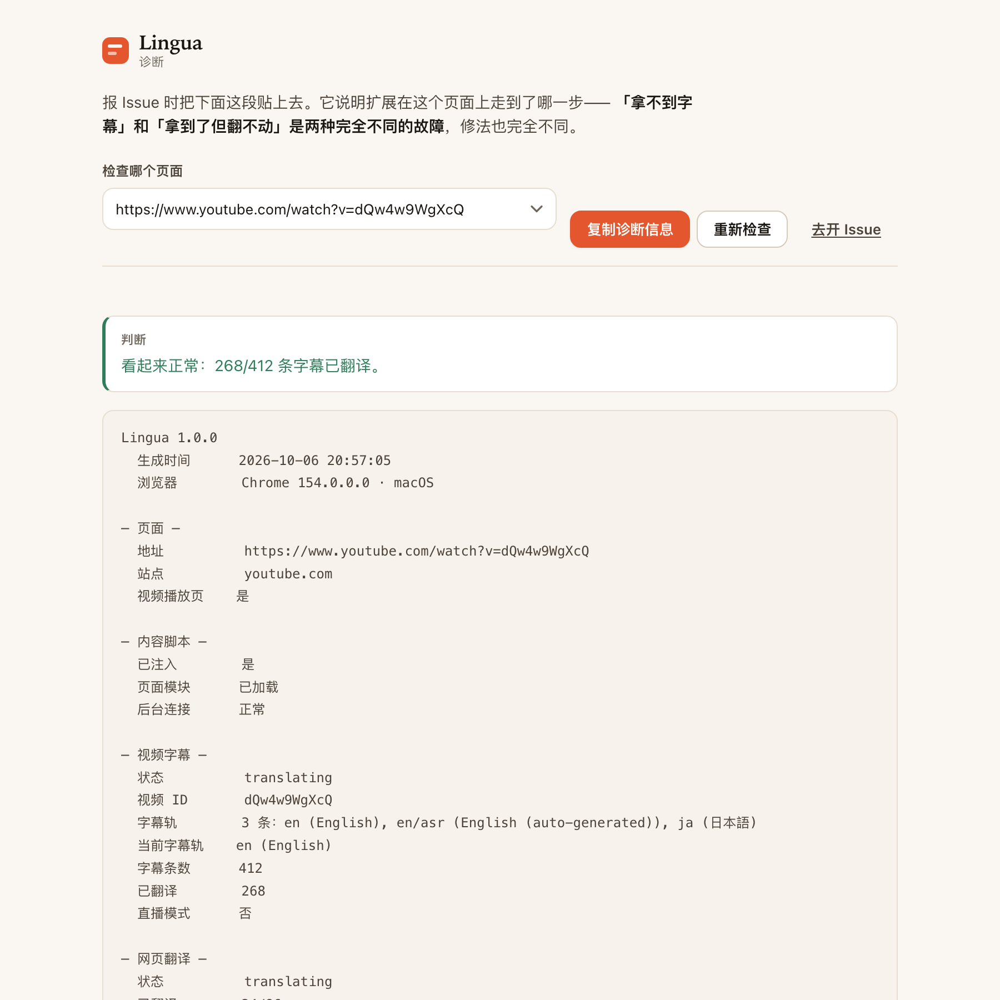 |

复制出来的那段信息可以直接贴进 [Issue](https://github.com/Momoxiao/lingua-translate/issues/new?template=bug_report.yml)。
它的价值在于说明扩展走到了哪一步——**「拿不到字幕」和「拿到了但翻不动」是两种完全不同的故障**，修法也完全不同；
只有一句「不能用」，远程没法定位。

诊断页**不包含**你的 API Key、译文内容、浏览历史或 Cookie。唯一可能带隐私的是当前页面的地址，贴之前可以自己删掉。

**「翻译失败：Extension context invalidated.」**

这是浏览器扩展的通用现象：在 `chrome://extensions` 里**重新加载/更新扩展**后，已经打开的页面里仍然跑着**旧版本的内容脚本**，它调用 `chrome.runtime` 时会抛这个错。

本扩展的做法是：检测到扩展上下文失效（`chrome.runtime.id` 消失）就**立即熔断**，并在播放器/页面上提示「扩展已更新，请刷新本页面后继续使用」，而不会把它当成普通翻译失败去无限重试。

**解决办法：刷新那个页面即可**（F5）。开发时每次改完代码 reload 扩展，都需要刷新页面。

**其他常见情况**

| 现象 | 原因与处理 |
| --- | --- |
| YouTube 显示「无字幕」 | 该视频确实没有字幕轨；或页面刚打开、播放器还没返回轨道，稍等或刷新 |
| 弹窗显示「取字幕失败」（字幕来源里却有轨道） | 视频有字幕，卡在向 YouTube 取数据这一步。诊断页的「状态原因」会写明是哪一种；这种情况请复制诊断信息开 Issue |
| 字幕只覆盖了视频开头一段 | 大概率是正在播放**贴片广告**（广告期间拿到的是广告的轨道）；等广告结束会自动重新加载 |
| 网页翻译漏了某些区域 | 该区域被识别为布局容器（flex/grid）或命中了忽略规则；可在设置里查看/调整「忽略选择器」 |
| 接口报 401 / 403 | API Key 或 Base URL 不对；用设置页的「测试连接」验证 |
| 接口报 429 | 触发限流；降低「并发请求数」，扩展本身也会自动退避重试 |
| 模型只输出推理内容、没有译文 | 在设置页把「模型推理」设为关闭，或换用非推理模型（如 `deepseek-chat`） |
| 提示「扩展已更新或重新加载」 | 在 `chrome://extensions` 重载扩展后，已打开的页面需要刷新一次 |

---

## 九、已知限制

- **视频字幕的获取链路没有自动化测试**。`youtube.js` / `inject.js` / `bridge.js` 依赖 YouTube 的私有播放器接口，无法在 CI 里覆盖；YouTube 一旦更新就可能失效，而且不会有任何自动化的东西提前告诉你。有 `npm run smoke` 可以手动跑一次真机冒烟（见第七节），但它要联网、不进 CI，而且**两种自动化环境都测不到真正的播放**——无头窗口和后台标签下播放器都不会去取字幕轨，所以它只能证明「字幕没开始渲染」，不能证明扩展坏了。要真测，需要一个可见、在前台的标签页。遇到失效请开 Issue。
- 只在 macOS 的 Chrome 上做过实测。Linux 上 CI 会跑三套测试（不含真机扩展的 e2e），但 **Edge / Firefox 未经验证**——Firefox 需要额外的 MV3 适配。
- 界面内置中文与英文两套文案。中文是源文案与回退；非中文浏览器进入英文界面。
- YouTube 字幕只在 `youtube.com` / `youtube-nocookie.com` 的播放页工作。
- 网页翻译暂不处理 iframe 内部（只在顶层文档运行），也不翻译图片内的文字。
- 直播场景的字幕走实时逐句翻译，仍无法像点播的整片预取模式一样提前翻译；支持流式输出时会边生成边显示，并只保留最新字幕的在途请求。
- `<all_urls>` 主机权限是网页翻译与「自定义供应商」所必需的；若只想要 YouTube 字幕，可把 `manifest.json` 里第三个 `content_scripts` 条目与 `<all_urls>` 一并删掉。
- 修改「供应商 / 语言 / 批量 / 并发」会触发当前页重新加载字幕；修改字号、对齐、译文样式等仅实时生效。
- 缓存不区分模型版本，换模型后如需重翻，可在设置页清空缓存。

---

## 十、设计取舍记录

- **为什么用编号批量而不是 JSON 数组？** 编号文本对模型的容错更高，且解析失败时可逐行回退；数组模式下模型少一个元素就会整体错位。
- **为什么把翻译放后台而不是内容脚本？** 内容脚本的 `fetch` 受页面 CORS 约束，无法请求任意第三方接口；后台有 `host_permissions` 可以直接请求。
- **为什么用长连接 port？** MV3 Service Worker 会在空闲时被回收，长连接能在整个翻译会话中保持存活，并把进度事件流式回传。
- **为什么默认隐藏原生字幕？** 双语叠加会和 YouTube 原生字幕重叠；若取字幕走了「截获播放器请求」的兜底路径，原生字幕需要在 DOM 中保持开启（用 `opacity:0` 隐藏而非移除），否则播放器不再发起请求。
- **网页翻译为什么按「元素」而不是「文本节点」分组？** 按文本节点会把 `<p>Hello <b>world</b></p>` 拆成两段、丢失语境；按元素分组则能把整个行内文本流作为一个单元，代价是需要显式排除 flex/grid 这类布局容器。
- **网页翻译为什么坚持不破坏原文？** 「仅译文」模式用包裹 + CSS 隐藏实现，而不是直接覆盖文本，这样「暂时收起译文」只是切 class，没有 DOM 重建、没有闪烁，也不会因为翻译失败而永久丢失原文。
- **为什么翻译失败的句子回退成原文而不是留空？** 用户至少能看到内容；同时用连续失败熔断（3 次）避免坏 key 把接口打爆。
- **扩展重载后旧页面怎么办？** 内容脚本会检测到 `chrome.runtime.id` 消失（即 "Extension context invalidated"），立即熔断并提示刷新页面，而不是把错误当成普通翻译失败无限重试。
- **进度消息为什么必须单独处理？** 长连接上既有「进度」又有「最终结果」两类消息。进度消息没有 `ok` 字段，如果让它穿透到最终响应的分支，就会被当成失败去 reject —— 表现是「前几批能翻、之后突然报翻译失败」。
- **为什么用播放器的 `pot` 而不是自己算？** BotGuard 的挑战需要一整套 VM，自己算既复杂又容易随 YouTube 更新失效；播放器已经把 token 拿到手了，直接复用最稳，而且实测该 token 绑定的是「视频+会话」而非具体轨道，可以跨轨复用。**前提是播放器真的请求过字幕**——这一点现在是可测量且已测量的（`npm run smoke` 通过 CDP 数 `/api/timedtext`，记录每条请求的 `pot` 与 HTTP 码）：**播放器在真实播放时会带上 pot 去取字幕，实测返回约 1.1–1.3 KB 真实数据。**早先「两种自动化环境都到不了真正的播放」的结论是错的——那几次只是没有任何一方要求显示字幕。登录状态则已被排除：真实已登录会话里 `fetch(baseUrl)` 同样返回 HTTP 200、body 长度 0，`baseUrl` 里同样没有 `pot`。仍然成立的一条：**复用能否成功取决于时序**，token 没在窗口内嗅到就落空，因此有实时兜底。
- **为什么诊断要标明「来源未知」而不是猜一个？** 原先按 `fmt=json3` 判断请求是谁发的，但 `inject.js` 的 URL 就是从播放器自己的 `baseUrl` 派生的，两者可能逐字节相同——这个启发式根本不成立。现在优先用 CDP 的 `initiator`，拿不到就写「来源未知」。诊断工具宁可承认缺口，也不能猜：猜出来的数字会被当成事实引用（这个坏启发式就一度以「确定的事实」的措辞写进过本文件）。
- **为什么「拿不到字幕」要分成两种说法？** `status: 'empty'` 同时表示「这个视频没有字幕」和「字幕轨在、但数据没取回来」，而这两件事的建议完全相反（前者无解，后者是要上报的 bug）。`reason` 原先只活在 emit 出来的事件里、没落到 `state`，于是弹窗和诊断页各自从 `tracks.length` 猜——两处都猜错了：它们一边列出 6 条字幕轨、一边在同一屏上说「该视频没有可用字幕」。现在 `setStatus` 把 `reason` 写进 `state`，快照带上它，措辞统一收在 `utils.emptySubtitleNote()` 一个函数里，`check-pages.mjs` 用「4 条轨 + 0 条 cue」这个 fixture 同时锁住弹窗和诊断页两处。
- **为什么宁可选原始语言轨也不选人工字幕？** 人工轨未必完整（实测有一条只覆盖 34/336 秒），而原始语言轨是播放器自己依赖的轨，完整性有保证。用户仍可在弹窗里手动指定源语言覆盖这一默认行为。
- **为什么 flex 容器自己的文本要单独处理？** 直接在 flex 容器里追加一个块级译文会变成一个 flex item、改变布局；而把**它自己的文本节点**包进一个行内 span 是布局中性的（正好顶替原来的匿名 flex item）。代价是译文只能行内排布，双语模式下按钮可能因此变宽换行——这是双语模式的固有代价。
- **为什么「仅译文」不直接隐藏原文了事？** 隐藏原文会连带隐藏 `<a>`，用户就再也点不到链接。所以用占位符把链接保护起来、译文里重建；一旦模型写坏标记就退回双语，并把开关交给用户。
- **为什么占位符用 `⟦⟧` 这种少见字符？** 它必须足够罕见，才不会和正文冲突；同时在提示词里明确「原样保留」后，模型对成对标记的保留率很高（实测 519 个链接只坏 1 个）。
- **为什么搬运真实元素而不是克隆？** 克隆只复制属性、不复制监听器。译文里的链接如果点不动、悬浮没反应，用户会觉得「翻译把页面搞坏了」——比不翻译更糟。搬运 + 记录位置 + 精确还原，代价是多一点簿记，换来的是页面行为完全不受影响。
- **为什么「文字没变就不动」？** 引用标注 `[1]`、数字、代码这类内容翻译后和原文一模一样，此时去改写 DOM 只有坏处没有好处。保持原样 = 结构、属性、事件全部零损失。
- **为什么一定要声明 `color-scheme`？** 表单控件（`<button>`、`<select>` 弹出层、滚动条、滑块）**不跟随 CSS 变量**，而是由浏览器按 `color-scheme` 决定原生样式。不声明它就永远是浅色默认值——深色模式下 `<button>` 的文字会是黑色，压在深色卡片上直接看不见。同理，`<button>` 默认**不继承 `color`**，必须显式 `color: inherit`。
- **为什么首屏优化选「小批次优先」而不是「更大并发」？** 并发受限于接口限流，而且用户感知的是**第一句出现的时间**，不是全部翻完的时间。先把 4 句放上屏幕，剩下的慢慢补。
- **为什么关闭推理要带自动回退？** 各家关闭推理的参数名不统一，而发送不认识的字段有接口会直接 400。默认关闭 + 400 时自动去掉参数重试，等于「有加速就拿，拿不到也不出错」，比让用户自己去查各家文档靠谱。
- **为什么进度不用累加计数器？** `done++` 这种写法看起来最自然，但它和「单元列表」的生命周期是两条独立的线：单元可能在计数之后被移出列表、或者在重试路径上被重复计数，一旦脱节就会出现「已翻译 391/381」这种完成数比总数还大的显示。改成**从每个单元的标记位推导**（`recount()`），`done <= total` 就成了构造上的必然，而不是靠调用顺序去保证。顺带修掉了一个真实的双计路径：某个 chunk 里若有一个单元渲染时抛错，整个 chunk 会被重新排队，而已渲染成功的那部分会被再翻一次——现在失败处理会跳过已完成的单元。
- **为什么动态内容到达时要把状态从「已完成」改回「翻译中」？** 否则页面翻完之后新加载的内容会静默翻译，而 UI 一直停在「已翻译」，用户以为它卡住了。
- **为什么设置页要「先 await 保存，再重渲染」？** `save()` 是异步的（`settings = await setSettings(...)`），在它 resolve 之前读 `settings.provider` 拿到的还是旧值。早期代码在点击卡片后立刻同步调用 `renderFields()`，结果**上面选中了新服务、下面还显示着旧服务的字段**——用户的原话是「翻译服务选择的对不上」。同类的坑还有一处：`save()` 只刷新了供应商卡片、没刷新面板头部，于是**输入 API Key 后卡片变成「已配置」，面板顶部却仍写着「未配置」**。现在把面板拆成 `renderPaneHeader()`（只改文字，可以随每次保存调用，不会抢焦点）和 `renderFields()`（重建输入框，只在切换供应商时调用）。
- **为什么 Azure 的「区域」不是必填？** `Ocp-Apim-Subscription-Region` 只对**区域资源**是必需的，全球资源可以不带。把它设成必填会把全球资源的用户直接挡在门外，所以 `providerReady` 只校验 Key，而把「区域」做成字段级提示（填错会返回 401）。另外原先的摘要文案在没填区域时会输出「使用中 · 未填区域」——这句话自己就前后矛盾，已改为不输出。
- **为什么防抖要合并补丁，而不是防抖整个 `save()`？** `debounce(fn)` 只保留**最后一次调用**的参数。原来的写法是 `saveDebounced(patch) = debounce(save, 320)`，于是 320ms 内编辑两个字段时，前一个字段的补丁被直接丢掉——填完 Base URL 立刻 Tab 到 API Key 继续输入，URL 就白填了。现在是「先把补丁 `deepMerge` 成一个，再写一次」，并且所有写入串行化（两次重叠的 `setSettings` 各自读到同一个基准，后写的那次会覆盖前一次）。
- **为什么设置页把高级项和说明折叠起来？** 设置页是拿来「扫」的不是拿来「读」的。默认展开的十项预设芯片、四组高级参数、整篇原理说明会把真正需要改的东西埋掉。折叠不是藏起来——`<details>` 一行摘要就能展开，且锚点导航照常工作。
- **为什么自定义供应商要自带校验？** 它是唯一一个让用户手写 HTTP 的地方，而固定供应商天然不会写错。校验规则全部对应 `custom.js` 里真实存在的分支：请求头不是合法 JSON 会直接抛错、`GET` 会丢弃请求体、请求体没有 `{{text}}` 就等于没发内容、缺 `{{to}}` 就翻不对语种。把这些在界面上先说清楚，比让用户去读接口文档再自己 debug 便宜得多。
- **为什么「没有可见文字的链接」不算链接？** VitePress（Vue / Vite / Vitest 文档用的框架）把每个标题渲染成 `<h1>Introduction <a class="header-anchor">&#8203;</a></h1>`——锚点里只有一个零宽空格。它会被当成真链接包成 `⟦1⟧⟦/1⟧`，而模型面对一对「里面什么都没有」的标记时基本会丢掉它，占位符校验随即失败、**整段回退保留原文**——表现就是这些文档站的标题永远不翻译。修法两条：`markLinks` 不再标记没有可见文字的锚点；`textOf` 顺手剥掉零宽与双向控制字符（`\s` 不匹配它们，所以空白折叠留不住）。`scripts/test-dom.mjs` 里用真实的 VitePress 标记锁住了这个 case。
- **为什么内部命名空间统一成 `Lingua`？** 它原本叫 `YTST`——项目早期文件夹名 `yt-subtitle-translator` 的缩写。产品叫 Lingua，代码里却住着两个名字，这本身就是「语义不统一」。113 处、34 个文件已全部对齐（`lingua-` 前缀的 CSS 类名与 storage key 本来就是对的，所以这次只是把 JS 命名空间补齐）。
- **为什么悬浮球 hover 时不能改变自己的命中区？** 贴边是靠 `translateX` 实现的，所以鼠标一进到球上，球就**从指针底下滑走**——浏览器随即派发 `pointerleave`，球缩回贴边，指针又落在球上，再浮出……在「浮出位置到屏幕边缘」那条 10px 带里会以约 4Hz 反复跳。进度环画在球**外面 3px**，那条缝同样在 hover 盒之外，是同一类抖动的第二个入口（也最接近用户说的「边框和悬浮球之间」）。两处都用**不可见的伪元素桥接**补齐命中区：`::after` 覆盖贴边滑走的那条带，`::before` 按 `--ring-gap` 外扩一圈。桥接只覆盖球原本就占着的位置，所以不会额外挡住页面。
- **为什么 `dock` 不再按「屏幕左右半」判定？** `dock` 回答的是「球是否靠在边上」，而 `opensRight` 回答的是「气泡往哪边展开」——两件事。原来用一个 `x > innerWidth / 2` 同时回答，导致 `translateX` 会作用在任何位置（包括拖拽途中的坐标），只是恰好被 `.dragging` 的 `transform:translateX(0)` 盖住了才没暴露。拆开后，平移只可能作用在它有意义的地方。
- **为什么弹窗的留白是硬约束而不是审美偏好？** Chrome 把扩展弹窗封顶在 **600px**，超出的部分会滚动——而一个要滚动才能看到最后两个开关的设置面板，看起来就像坏了。所以弹窗的纵向节奏按预算压：网页翻译面板 **521px**（YouTube 上多一条切换器，549px）、视频字幕面板 **493px**，`check-pages.mjs` 把这条写成了断言（量的是 `.pop` 盒子本身，不是 `scrollHeight`——内容比视口短时 `scrollHeight` 会报视口高度，反而掩盖问题）。
- **弹窗里的控件为什么要小一档？** 设置页有整屏可用，控件按阅读尺寸给（`padding: 8px 14px`）；弹窗只有 356px 宽、还压着 600px 的高度预算，所以 `.pop` 内的 `select` / `btn` / `segmented` / 字段间距统一下调一档。**用 `.pop` 作用域而不是改主题**——两个界面的可用空间本来就不同，把设置页也改小是另一件事。同一轮把纵向节奏从设置页的 16px 收到 8px，视频字幕面板因此少了 53px。
- **为什么字体栈要写在 `constants.js` 而不是只有 theme.css？** 弹窗和设置页从 theme.css 的自定义属性取字体，而悬浮球与字幕层是在 Shadow DOM 里用 JS 模板字符串拼样式——**CSS 自定义属性没法被 import 进 JS 字符串**。所以重复无法避免，能避免的是让它漂移：`constants.FONTS` 是唯一真源，`test-core.mjs` 逐条比对 theme.css 里的 `--font-*`，并断言内容脚本里不再出现手写的字体栈（`ui-sans-serif` 与 `system-ui` 的差别，正是那种直到两边看起来微妙地不一样才会被发现的东西）。

---

## 十一、界面设计系统

四个界面（弹窗、设置页、页面悬浮球、字幕层）共用一套 token，全部定义在 `src/ui/theme.css`：

| 类别 | 内容 |
| --- | --- |
| 颜色 | `--paper / --paper-2 / --surface / --surface-2`（三层平面）、`--ink / --ink-2 / --ink-3`（三级文字）、`--line / --line-2`、一个朱红 `--accent` 与 `--ok / --warn / --err` 状态色 |
| 层级 | 深色模式下三层平面刻意拉开（页面 `#12100d` < 下沉 `#1a1714` < 抬升 `#241f19`），否则选中的标签页、输入框和卡片会糊成一片 |
| 字号 | `--fs-11 … --fs-30`；正文无衬线，标题与品牌用衬线（Iowan / Palatino / Georgia 栈） |
| 间距 | `--sp-1 … --sp-9`（4/6/8/12/16/20/24/32/44） |
| 圆角 | `--r-xs … --r-xl` + `--r-pill`；嵌套圆角用「外层半径 − 内边距」计算 |
| 动效 | 统一 `--ease` / `--dur`，并在 `prefers-reduced-motion` 下全部关闭 |

**组件层**（同样在 `theme.css`）：`field / label / hint`、`switch`、`segmented`、`btn`（`--primary / --ghost / --sm / --block`）、`pill`、`progress`、`card`、`divider`、`disclosure`、`note`、`num`、`sr-only`。

字体栈是唯一一处「必须写两份」的 token：弹窗与设置页读 `--font-body / --font-display / --font-mono`，而悬浮球与字幕层在 Shadow DOM 里拼 JS 字符串，只能从 `constants.js` 的 `FONTS` 取。两份由 `npm test` 逐条比对，见第十节的取舍记录。

### 术语表（全产品唯一用词）

同一个概念只允许一个词——UI、README、manifest、错误信息全部对齐：

| 概念 | 唯一用词 | 曾经混用过 |
| --- | --- | --- |
| 整个功能域 | **翻译服务** | — |
| 其中一个可选项 | **供应商** | 服务商 |
| 自己写 HTTP 的那个 | **自定义供应商** | 自定义 API 模板 |
| 翻译整张网页 | **网页翻译** | 整页翻译 |
| 翻译 YouTube 字幕 | **视频字幕** | YouTube 双语字幕 |
| 原文 + 译文并排 | **双语** | 原文 + 译文 |
| 停止翻译 | **停止** | 关闭 |
| 收起译文 | **暂时收起译文** | 只显示原文 / 显示原文 |
| 接口凭据 | **凭据** | Key |

### 一条产品规则：面板随页面上下文切换

扩展面板默认只显示**一个**面板，由页面决定：普通页面显示「网页翻译」，YouTube 视频页显示「视频字幕」。切换器只在**两半都成立**的地方出现 —— 也就是 YouTube 视频页：视频有字幕可翻，描述与评论区也有正文可翻。别的地方多一个标签就是死路，所以不显示。当前模式写进品牌副标题（`视频字幕` / `网页翻译`），用户永远知道自己在哪一半。

这个切换器差点没做成：加上它之后，YouTube 上的网页翻译面板变成 **602px**，而 Chrome 的弹窗上限是 600px。硬挤不是办法，于是把「翻译风格」从独立一行并进状态卡的第二行（`youtube.com · 社区讨论`）——它回答的本来就是同一个问题：这个页面正在发生什么。省下 29px。

几条贯穿全站的规范：

- **焦点可见**：所有可交互元素统一 `:focus-visible` 描边，而不是只给输入框做。
- **表单控件继承主题**：`button/input/select/textarea { font: inherit; color: inherit }` + `color-scheme`，否则裸 `<button>` 会退回 UA 黑色文字。
- **开关行即列表项**：`.switchRow` 自带顶部发丝线、整行可点（外层是 `<label>`），因此一列开关读起来是「一组设置」而不是一堆散落的勾选框。
- **滑块自绘**：原生 range 轨道几乎无法跨引擎定制，于是用 `--pct` 变量驱动 `linear-gradient` 画出已填充部分，并显式绘制滑块；`--pct` 由 `options.js` 在渲染与拖动时写入。
- **弹窗不做内嵌卡片**：Chrome 绘制弹窗窗口本身是直角，无法圆角化；在方框里套一张圆角卡只会更难看。所以弹窗贴边铺满，只让内部元素带圆角。
- **整页译文分「块级 / 行内」两种形态**：块级译文独占一行并带左侧标记；行内译文（导航链接、短标签）跟在原文后面，用一个小间隔隔开。判定规则见下一节。
- **译文配色全部由 `currentColor` 派生**，因此在浅色站、深色站、自定义主题站上都能保证可读性，无需知道对方的调色板。

### 一个被 CSS 藏起来的布局 bug

`display` 的**计算值**不等于作者写下的值：flex/grid 容器会把子元素「块级化」，于是 `<nav style="display:flex"><a>Home</a></nav>` 里的 `<a>` 计算出来是 `display:block`。

早先的规则直接信任计算值，结果是每个导航链接的译文都被当成块级元素追加到链接**下面**，导航栏被撑成两行——在 GitHub、Wikipedia、MDN 上都能看到。现在的规则是：**行内标签 + 父元素是 flex/grid** 视为「被父级块级化」，仍然按行内渲染；但只对短文本（≤ 40 字）这么做，长段落的译文依旧独占一行，因为把长句塞进行内会变成一坨流水账。这条规则由 `scripts/test-dom.mjs` 里的四个断言锁定。

### 另一个被 SVG 属性藏起来的坑（悬浮球进度环）

进度环一开始写成 `<svg width="50" height="50">` + `inset: -3px`，看起来是居中的，实际渲染出来却偏向右下角，环与球的间距左边 2px、右边 4px。

原因是 **`width`/`height` 这类 presentation attribute 会被当成真实的 CSS 尺寸**：一旦元素有了确定尺寸，`inset` 的四个值就成了「过约束」，在 LTR 下 `right`/`bottom` 会被直接丢弃——于是环被锚在左上角，而不是向四周扩展。实测 `getBoundingClientRect()`：球 44×44 中心 (728,162)，环 50×50 中心 (729,163)，偏移 (+1,+1)。

修法是**把尺寸完全交给 CSS 盒子**：去掉 SVG 的 `width`/`height` 属性，改由 `left/top` + `width: calc(100% + gap*2)` 明确定义（`100%` 相对球的 padding box 解析），再让 `viewBox` 在盒子里等比居中。修完后实测偏移 **(0, 0)**。

环与球之间留 3px：这样描边正好压在球体边缘上，白色弧线始终落在球自己的深色/朱红底面上，不论页面是浅色还是深色都清晰——如果让环悬在页面背景上，浅色站点里白弧会直接消失。

---

## 十二、隐私

**没有自建后端，不收集、不上传、不存储任何用户数据。** 唯一离开你设备的内容是**正在被翻译的文本**，它直接发往**你自己配置的那个翻译服务**，不经过我们。

- 凭据（API Key / 区域）、翻译缓存、设置：只存在 `chrome.storage.local`，凭据只随请求发给你选定的那一个服务。
- 无埋点、无统计、无账号；不读历史记录、书签、下载。
- 诊断信息只在你点「复制诊断信息」时生成，其中**不含 API Key，也不含任何译文内容**；唯一可能带隐私的是当前页面地址，贴出去之前可以自己删掉（诊断页和 Issue 模板都写了这一点）。
- 翻译敏感内容时，用本地部署的供应商（Ollama / LM Studio 等）——那样文本根本不出你的机器。

完整说明（含权限逐条用途、第三方服务清单）：[`PRIVACY.md`](PRIVACY.md)。上架提交所需的表单字段、权限理由与数据用途声明，见 [`store/SUBMISSION.md`](store/SUBMISSION.md)。

---

## 十三、许可证

[MIT](LICENSE)。你可以自由使用、修改、再发布，包括商业用途，只需保留版权声明。欢迎在自己的 fork 上继续做。
